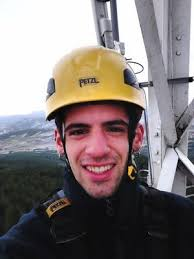

# CURRICULUM VITAE

## DATOS PERSONALES

- **Nombre**: Liher Gallego Gartziandia

- **Domicilio**: Iruña (Navarra)

- **E-mail**: liher2011@gmail.com

- **Telf**: 942345567

- **Móvil**: 634567788

## EXPERIENCIA

 ### Oficial de 2a en la empresa:

  - Tximista comunicaciones estratégicas, Alibarra (Pabellon34),1, Vitoria-Gasteiz.

- **Duración del contrato (2años): Del 20/06/16 al 19/06/18.**

- Trabajos realizados en la empresa:

	- Instalación de radio enlaces en torre.
	- Instalación y puesta en marcha de equipos MPR mss-8 de Alcatel lucent.
	- Instalación de sistemas radiantes para TDT
	- Instalación de antenas SAT
	- Instalación de inhibidor PDCE

### Peon electricista en la empresa:

 - Aldakir S.L (Pabellon1),23, Altsasu
		
- **Duración del contrato (6 meses): Del 10/09/19 al 10/03/20**.

- Trabajos realizados en la empresa:

	- Instalación de equipos anti incendios.

## TITULOS

- **Grado Superior** en Sistemas de Telecomunicaciones e Informáticos (2014/2016)

	- *Centro de estudio*: CIFP Mendizabala LHII, Portal de Lasarte, s/n, 01007 Vitoria-Gasteiz (Álava, Araba)

	- **Conocimientos adquiridos**:

		- Sistemas informáticos y redes locales.
		- Desarrollo y planificación de sistemas basados en la ICT
		- Estructura y funcionamiento de estudios de TV.
		- Planificación y proyección de sistema de Hogar digital.
		- Calculo y planificación de radio enlaces.
		- Telefonía IP

	- El 2º curso del ciclo se realizo en la modalidad de de formación dual

		- Empresa: Tximista comunicaciones estratégicas, Alibarra (Pabellon34),1, Vitoria-Gasteiz.
		- Duración del contrato: Del 08/06/2015 al 07/06/2016.

- **Grado Medio** de Técnico de instalaciones de Telecomunicaciones (2012/2014)

	- Centro de estudio: CIFP Mendizabala LHII, Portal de Lasarte, s/n, 01007 Vitoria-Gasteiz (Álava, Araba)

	

## CURSOS

- Capacitación y acreditación de trabajos en altura: Landher servicios de Formación

- Operador plataformas móviles IPAF (1b,3a,3b): Displacar SL (Grupo Cruz Araba).

- Trabajos con riesgo eléctrico (6h presenciales): ASEM Visiones Competitivas S.L.

- Riesgos durante los trabajos en espacios confinados (10h): ASEM Visiones Competitivas S.L.

- Prevención de riesgos laborales (30h): C.I.F.P Mendizabala

## IDIOMAS

- Euskera

- Ingles

## CARNET DE CONDUCIR

- Tipo: B

